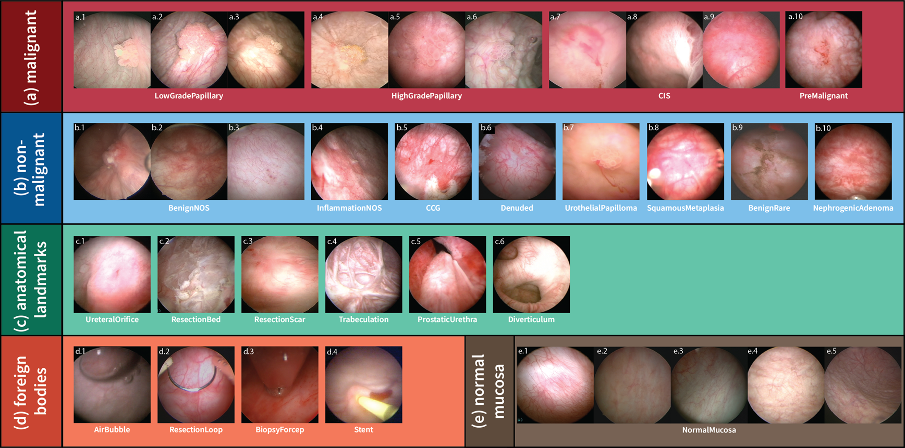

# CystoDS, a multi-class image dataset for computer-assisted cystoscopy
**CystoDS** is a curated image dataset for bladder cancer research, designed for the development and validation of AI-based cystoscopic image classification models. It includes 8,067 images from 160 patients labelled with five classes and 22 subclasses, along with segmentation data for 768 of the images.

This repository provides:
- Dataset overview
- Model evaluation results
- Download links for trained models
- Optional scripts for inference demonstration

> 🔧 Code is not provided here since all models were implemented using [OpenMMLab's MMPRETRAIN](https://github.com/open-mmlab/mmpretrain).
>
> ---
>
> ## 📦 Dataset Summary

- **Total Images**: 8,067
- **Categories**:
  - malignant
  - non-malignant
  - anatomical landmarks
  - foreign bodies
  - normal mucosa
- **Source**: Cystoscopy videos with pathology-confirmed labeling
- **Annotations**: label-level, expert-verified

---

## 🧠 Models Used for Evaluation

We validated CystoDS using four backbone architectures from MMPRETRAIN:
- ResNet
- ResNeXt
- HRNet
- Swin-Transformer

See [OpenMMLab's MMPRETRAIN](https://github.com/open-mmlab/mmpretrain) for details.

---

## 🚀 Download Trained Models

| Model                | Download Link             |
|---------------------|----------------------------|
| ResNet-50           | [Google Drive](#)          |
| EfficientNet-B0     | [Google Drive](#)          |
| HRNet-W18           | [Google Drive](#)          |
| Swin-Tiny           | [Google Drive](#)          |

All checkpoints are fine-tuned on CystoDS.

---

## 📋 Evaluation Results

| Model              | Sensitivity | Specificity | Accuracy | Precision | F1-Score |
|-------------------|-------------|-------------|----------|-----------|----------|
| ResNet           | 0.692       | 0.787       | 0.731    | 0.826     | 0.753    |
| ResNeXt          | 0.754       | 0.787       | 0.767    | 0.838     | 0.794    |
| HRNet            | 0.692       | 0.910       | 0.781    | 0.918     | 0.789    |
| Swin-Transformer | 0.846       | 0.809       | 0.831    | 0.866     | 0.856    |

---

## 📌 Citation

@article{
  title={CystoDS: a multiclass endoscopy image dataset for artificial intelligence-assisted bladder cancer detection},
  author={Tim and et al.},
  journal={Scientific Data},
  year={2025}
}

